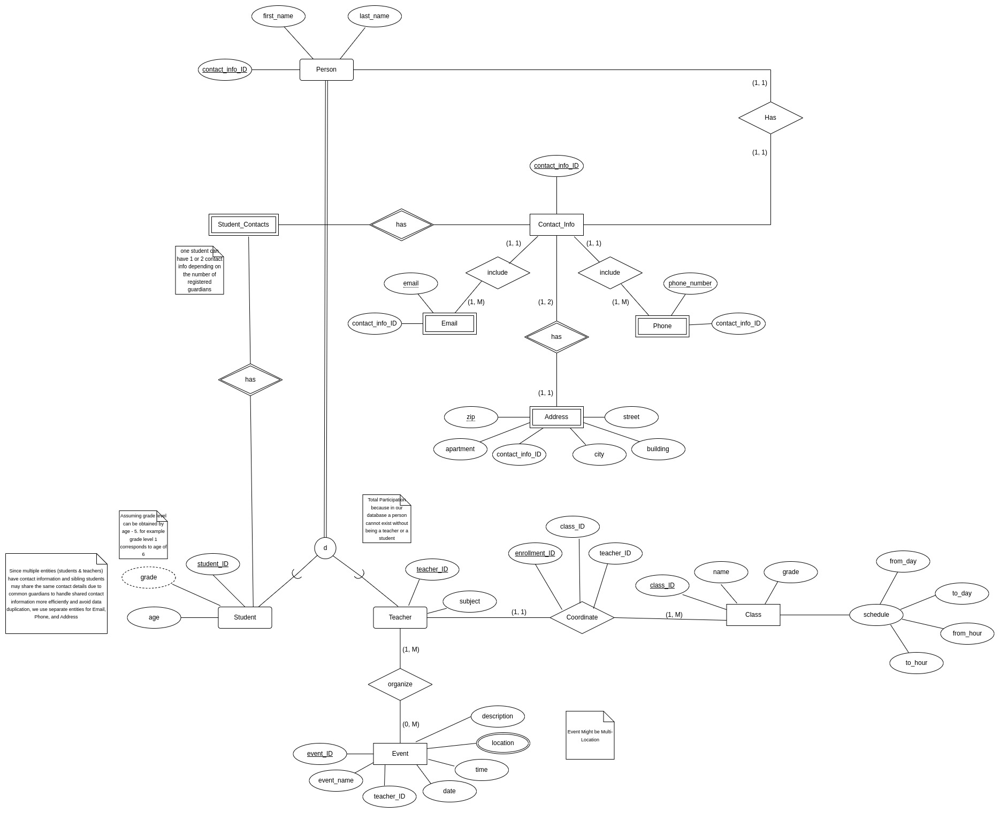
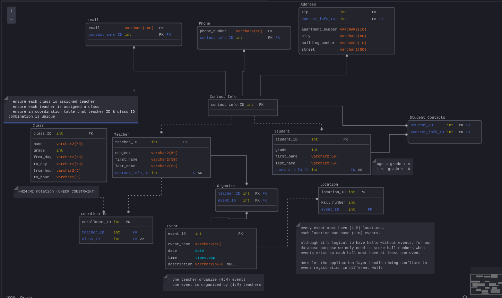

<!-- PROJECT SHIELDS -->
[![Contributors][contributors-shield]][contributors-url]
[![Forks][forks-shield]][forks-url]
[![Stargazers][stars-shield]][stars-url]
[![Issues][issues-shield]][issues-url]
[![LinkedIn][linkedin-shield]][linkedin-url]

<!-- PROJECT LOGO -->
 

<h3 align="center">School Management System Database (SMS Database)</h3>

  

<!--     <a href="https://github.com/youssef-mansor/CLIR-using-BERT">View Demo</a> -->
<!--     · -->
    <a href="https://github.com/youssef-mansor/CLIR-using-BERT/issues">Report Bug</a>
    ·
    <a href="https://github.com/youssef-mansor/CLIR-using-BERT/issues">Request Feature</a>
  

## About The Project

SMS is a comprehensive database application designed to streamline and
enhance the administrative and academic management of educational
institutions. The core of the SMS is a relational database that
integrates all facets of school operations, from student and teacher
management to class scheduling and event organization.

### Main Functionality:

- **1. Student and Teacher Profiles**: Storage of detailed information for
students and teachers, including contact information like emails, phone
numbers, and addresses.

- **2. Class Management:** Management of class schedules, including
details about subjects, timings, and assigned teachers.

- **3. Event Organization:** Coordination and planning of school events,
with features to manage dates, times, locations, and involved personnel

- **4. Contact Management:** Handling multiple contact details for
students to avoid redundancy and ensure comprehensive communication
channels.

## EER Model

## Relational Schema

The schema is fully normalized and comprehensively delineates all
tables, attributes, primary keys, and foreign keys, which are all
predicated on the aforementioned Entity-Relationship (ER) diagram.
Referential integrity is guaranteed through the judicious assignment of
foreign keys. Given that the relational schema is normalized, functional
dependencies exist in relation to the primary keys.

## How to Use

The creation, population, and testing of the database is divided into 3
different files in the code folder.

- database_SQL_INIT (Tables initialization)
- Populating_Database (Populating the tables with data)
- Selection_Queries_Testing (Testing)

To see the results of the execution of the above code refer to the
document named "screenshots"

## Tech Stack

The project utilizes the following Oracle database technologies:

<!-- MARKDOWN LINKS & IMAGES -->
[contributors-shield]: https://img.shields.io/github/contributors/youssef-mansor/CLIR-using-BERT.svg?style=for-the-badge
[contributors-url]: https://github.com/youssef-mansor/CLIR-using-BERT/graphs/contributors
[forks-shield]: https://img.shields.io/github/forks/youssef-mansor/CLIR-using-BERT.svg?style=for-the-badge
[forks-url]: https://github.com/youssef-mansor/CLIR-using-BERT/network/members
[stars-shield]: https://img.shields.io/github/stars/youssef-mansor/CLIR-using-BERT.svg?style=for-the-badge
[stars-url]: https://github.com/youssef-mansor/CLIR-using-BERT/stargazers
[issues-shield]: https://img.shields.io/github/issues/youssef-mansor/CLIR-using-BERT.svg?style=for-the-badge
[issues-url]: https://github.com/youssef-mansor/CLIR-using-BERT/issues
[license-shield]: https://img.shields.io/github/license/youssef-mansor/CLIR-using-BERT.svg?style=for-the-badge
[license-url]: https://github.com/youssef-mansor/CLIR-using-BERT/blob/main/LICENSE
[linkedin-shield]: https://img.shields.io/badge/-LinkedIn-black.svg?style=for-the-badge&logo=linkedin&colorB=555
[linkedin-url]: https://www.linkedin.com/in/youssef-m-86a690174/
[product-screenshot]: images/screenshot.png
